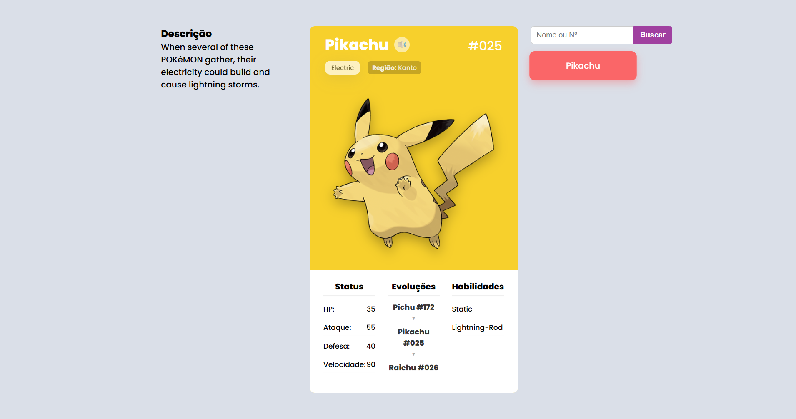

# Pokédex Dinâmico com Webpack  Pokédex Dinâmico com Webpack

() Uma aplicação web moderna e responsiva que permite aos usuários explorar informações detalhadas sobre Pokémon, utilizando a [PokéAPI v2](https://pokeapi.co/) como fonte de dados. Este projeto foi construído com HTML, CSS e JavaScript puros (ES6+), mas utiliza um robusto processo de build gerenciado pelo Webpack 5 para otimização, modularização e um fluxo de desenvolvimento eficiente.

## ✨ Funcionalidades Principais

* **Busca de Pokémon:** Pesquise por nome ou número da Pokédex.
* **Visualização Detalhada:** Exibe informações completas:
    * Stats (HP, Ataque, Defesa, Velocidade)
    * Habilidades
    * Tipo(s) com cores correspondentes no card
    * Imagem oficial (Artwork) com fallback para Sprite pixelado
    * Número da Pokédex
    * Grito / Som do Pokémon (clicável) 🔊
    * Cadeia de Evolução (com nomes e números)
    * Descrição da Pokédex (em Português ou Inglês)
    * Região / Geração de origem (ex: Kanto)
    * Status especial (Lendário / Mítico)
* **Lista de Recentes:** Mantém um histórico dos últimos 6 Pokémon visualizados (usando `localStorage`).
* **Interface Responsiva:** Layout adaptável para desktops e dispositivos móveis.
* **Feedback Visual:**
    * Animações suaves (fade-in/out) na troca de Pokémon.
    * Estado de carregamento visual (spinner).
    * Card de erro customizado para buscas "Não Encontradas".

## 🛠️ Tecnologias Utilizadas

* **Frontend:**
    * HTML5 (Semântico)
    * CSS3 (Flexbox, Media Queries, Transições)
    * JavaScript (ES6+ Padrão, Módulos `import`/`export`, `async`/`await`, `fetch`)
* **API:**
    * [PokéAPI v2](https://pokeapi.co/)
* **Build Tool & Desenvolvimento:**
    * **Webpack 5:** Para empacotamento (bundling), otimização e gerenciamento de módulos.
        * `webpack-cli`: Interface de linha de comando.
        * `webpack-dev-server`: Servidor de desenvolvimento com Hot Module Replacement (HMR).
    * **Loaders & Plugins Webpack:**
        * `html-webpack-plugin`: Gera o `index.html` final com scripts/links injetados.
        * `mini-css-extract-plugin` & `css-loader`: Processam e extraem o CSS para um arquivo separado.
        * `copy-webpack-plugin`: Copia assets estáticos (imagens) para o build final.
    * **Node.js & npm:** Gerenciador de pacotes e ambiente de execução para as ferramentas de build.
* **Persistência:**
    * `localStorage`: Para armazenar a lista de Pokémon recentes.

## 🚀 Como Executar Localmente

Você precisará ter o [Node.js](https://nodejs.org/) (que inclui o npm) instalado em sua máquina.

1.  **Clone o repositório:**
    ```bash
    git clone [https://github.com/alessandrolsdev/Pokedex.git]
    cd seu-repositorio-pokedex
    ```

2.  **Instale as dependências:**
    ```bash
    npm install
    ```

3.  **Inicie o servidor de desenvolvimento:**
    ```bash
    npm run start
    ```
    Isso abrirá automaticamente o Pokédex no seu navegador padrão (geralmente em `http://localhost:8080`). O servidor recarregará automaticamente quando você fizer alterações nos arquivos `src/`.

4.  **Para gerar o build de produção:**
    ```bash
    npm run build:prod
    ```
    Isso criará uma pasta `dist/` otimizada, pronta para ser hospedada em qualquer servidor web estático.

## 🌐 Deploy (Link Online)

*Você pode acessar a versão online deste projeto aqui:*
[**https://pokedex-lsdev.netlify.app**] ## 🔮 Próximos Passos (Possíveis Melhorias)

* [ ] Tornar os nomes na lista de evolução clicáveis.
* [ ] Adicionar paginação ou scroll infinito para a lista principal (se fosse implementada).
* [ ] Implementar testes unitários ou de integração.
* [ ] Melhorar acessibilidade (atributos ARIA).

---

Feito com ❤️ por um fã de pokémon